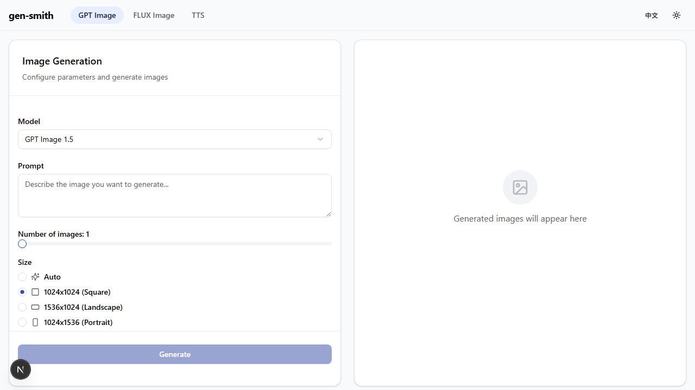
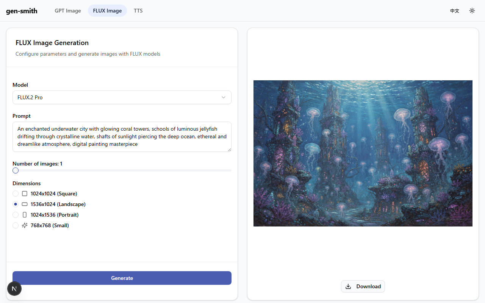
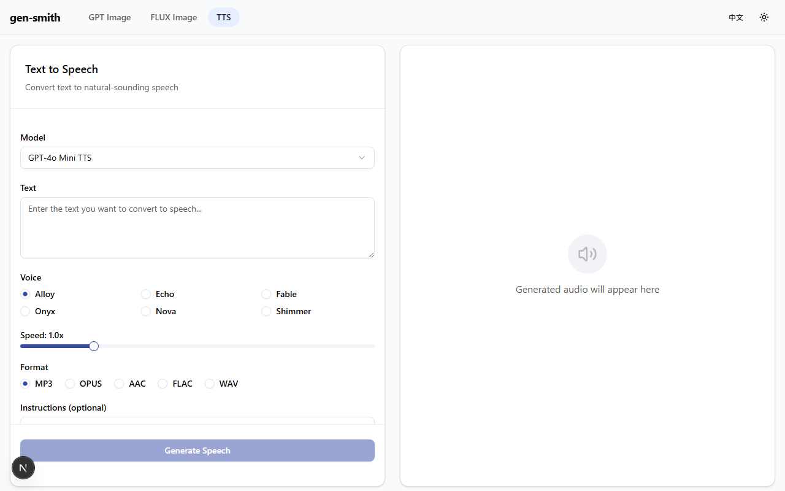

[English](README.md) | [中文](README.zh.md)

# gen-smith

一个轻量级的生成式 AI 模型试验场 —— 连接 Azure AI Foundry，通过直观的 Web 界面体验图像生成和文字转语音功能。

## 功能特性

- **GPT 图像试验场** —— 使用 gpt-image-1.5、gpt-image-1 和 gpt-image-1-mini 生成图像，支持完整的参数控制（尺寸、质量、背景、格式、内容审核）
- **FLUX 图像试验场** —— 通过 Azure AI Foundry 无服务器端点，使用 FLUX.2-pro 和 FLUX.2-flex 生成图像
- **文字转语音试验场** —— 使用 gpt-4o-mini-tts 将文字转换为语音，提供 6 种声音选择、语速控制和风格指令
- **双栏布局** —— 左侧配置表单，右侧输出结果
- **多图网格** —— 一次生成最多 4 张图像，支持网格视图、缩略图轮播和单图放大
- **灵活认证** —— 每个模型支持 API 密钥、Azure CLI 令牌（Entra ID）和托管标识认证
- **JSON 配置** —— 仅已配置并启用的模型会显示在界面中
- **明暗主题** —— 默认优雅的浅色主题，配有柔和的靛蓝色调，同时支持暗色主题切换
- **双语界面** —— 支持中英文，自动检测浏览器语言
- **下载功能** —— 保存生成的图像（PNG/JPEG/WebP）和音频文件（MP3/OPUS/AAC/FLAC/WAV）

## 截图

### GPT 图像试验场



### FLUX 图像试验场



### 文字转语音试验场



## 支持的模型

| 类别     | 页面       | 模型                                          | API 类型                     |
|----------|------------|-----------------------------------------------|------------------------------|
| 图像生成 | GPT Image  | gpt-image-1.5, gpt-image-1, gpt-image-1-mini | OpenAI SDK (images/generations) |
| 图像生成 | FLUX Image | FLUX.2-pro, FLUX.2-flex                       | Azure AI Foundry 无服务器    |
| 音频生成 | TTS        | gpt-4o-mini-tts                               | Azure 认知服务               |

## 快速开始

### 前提条件

- [Node.js](https://nodejs.org/) 20+
- npm（随 Node.js 一同安装）
- 已部署一个或多个模型的 Azure AI Foundry 资源

### 安装

```bash
git clone https://github.com/1w2w3y/gen-smith.git
cd gen-smith
npm install
```

### 配置

复制示例配置文件并填写你的模型端点和凭据：

```bash
cp config.example.json config.json
```

编辑 `config.json`，填入你的 Azure 部署信息。设置 `"enabled": false` 或移除模型条目可将其从界面中隐藏。

**API 密钥认证：**

```json
{
  "auth": {
    "type": "apiKey",
    "apiKey": "your-api-key"
  }
}
```

**Azure CLI 认证（推荐用于开发环境）：**

```json
{
  "auth": {
    "type": "azureCli"
  }
}
```

启动开发服务器前，请确保已通过 `az login` 登录。

### 运行

```bash
npm run dev
```

打开 [http://localhost:3000](http://localhost:3000)。

### 测试

```bash
npm test
```

## Docker

预构建的 Docker 镜像可从 GitHub Container Registry 获取。容器监听 **3000 端口**。

```
ghcr.io/1w2w3y/gen-smith:latest
```

### 快速启动

拉取并通过环境变量配置模型运行：

```bash
docker pull ghcr.io/1w2w3y/gen-smith:latest

docker run -p 3000:3000 ghcr.io/1w2w3y/gen-smith:latest
```

### 示例：使用托管标识的 GPT Image

```bash
docker run -p 3000:3000 \
  -e GEN_SMITH_GPT_IMAGE_ENDPOINT=https://your-resource.openai.azure.com \
  -e GEN_SMITH_GPT_IMAGE_AUTH_TYPE=managedIdentity \
  -e GEN_SMITH_GPT_IMAGE_CLIENT_ID=xxxxxxxx-xxxx-xxxx-xxxx-xxxxxxxxxxxx \
  -e GEN_SMITH_GPT_IMAGE_DEPLOYMENTS=gpt-image-1 \
  ghcr.io/1w2w3y/gen-smith:latest
```

### 环境变量

每个模型系列通过 `GEN_SMITH_<FAMILY>_` 前缀进行配置。设置 `_ENDPOINT` 变量即可启用对应系列 —— 仅启用的系列会显示在界面中。

| 变量 | 说明 |
|------|------|
| `GEN_SMITH_GPT_IMAGE_ENDPOINT` | Azure OpenAI 端点 |
| `GEN_SMITH_GPT_IMAGE_API_KEY` | API 密钥（使用 `apiKey` 认证时） |
| `GEN_SMITH_GPT_IMAGE_AUTH_TYPE` | `apiKey`（默认）、`azureCli` 或 `managedIdentity` |
| `GEN_SMITH_GPT_IMAGE_CLIENT_ID` | 托管标识的客户端 ID |
| `GEN_SMITH_GPT_IMAGE_DEPLOYMENTS` | 逗号分隔的部署名称（默认：`gpt-image-1`） |
| `GEN_SMITH_GPT_IMAGE_API_VERSION` | API 版本（默认：`2024-10-21`） |
| `GEN_SMITH_FLUX_IMAGE_ENDPOINT` | Azure AI Foundry 端点 |
| `GEN_SMITH_FLUX_IMAGE_API_KEY` | API 密钥 |
| `GEN_SMITH_FLUX_IMAGE_DEPLOYMENTS` | 逗号分隔（默认：`FLUX.2-pro`） |
| `GEN_SMITH_TTS_ENDPOINT` | Azure 认知服务端点 |
| `GEN_SMITH_TTS_API_KEY` | API 密钥 |
| `GEN_SMITH_TTS_DEPLOYMENTS` | 逗号分隔（默认：`gpt-4o-mini-tts`） |

也可以挂载 `config.json` 进行高级配置：

```bash
docker run -p 3000:3000 -v ./config.json:/app/config.json ghcr.io/1w2w3y/gen-smith:latest
```

## 项目结构

```
src/
  app/
    image/gpt/        GPT 图像试验场页面
    image/flux/        FLUX 图像试验场页面
    audio/tts/         文字转语音试验场页面
    api/
      image/generate/  GPT 图像 API 路由（OpenAI SDK）
      image/flux/      FLUX 图像 API 路由（直接 REST）
      audio/tts/       TTS API 路由（直接 REST）
      config/          脱敏配置端点
  components/
    image/             GenerationForm, FluxGenerationForm, ImageOutput
    audio/             TTSForm, AudioOutput
    layout/            Navbar, ThemeProvider, LanguageProvider
    ui/                shadcn/ui 基础组件
  hooks/               useGenerateImage, useGenerateFluxImage, useGenerateSpeech
  lib/                 配置加载器、认证辅助工具、通用工具
  types/               TypeScript 类型定义
config.example.json    模板配置（已提交）
config.json            包含密钥的用户配置（已 gitignore）
```

## 技术栈

- [Next.js 15](https://nextjs.org/)（App Router）+ [React 19](https://react.dev/) + [TypeScript](https://www.typescriptlang.org/)
- [Tailwind CSS v4](https://tailwindcss.com/) + [Radix UI](https://www.radix-ui.com/)（通过 shadcn/ui）
- [OpenAI Node SDK](https://github.com/openai/openai-node) 用于 GPT Image 模型
- [@azure/identity](https://github.com/Azure/azure-sdk-for-js/tree/main/sdk/identity/identity) 用于 Entra ID / Azure CLI 认证
- [Vitest](https://vitest.dev/) + [Testing Library](https://testing-library.com/) 用于测试

## 文档

- [产品需求文档（PRD）](docs/PRD.md)
- [技术设计文档](docs/DESIGN.md)

## 许可证

[MIT](LICENSE)
